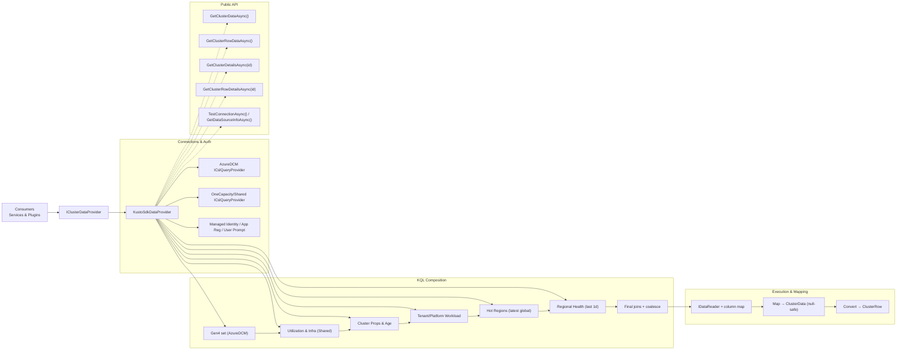

# Data Layer — Full Documentation

## Purpose

The data layer centralizes how we fetch, shape, and expose cluster telemetry for the rest of the system. It defines a clean interface (`IClusterDataProvider`), a concrete Kusto-backed provider (`KustoSdkDataProvider`), and the domain models we pass to services and plugins (`ClusterData` → `ClusterRow`). It also handles connection/auth, KQL query sourcing, execution/retries, and null-safe mapping to C# objects.

---

## Key Components

### 1) Contract: `IClusterDataProvider`

This interface is the single entry point the rest of the app depends on. It exposes list/detail reads in both the rich (`ClusterData`) and flat (`ClusterRow`) shapes, plus health utilities to test connectivity and describe the data source【turn13file6†IClusterDataProvider.cs†L8-L20】【turn13file6†IClusterDataProvider.cs†L22-L41】.

* `Task<List<ClusterData>> GetClusterDataAsync()`
* `Task<ClusterData?> GetClusterDetailsAsync(string clusterId, CancellationToken ct = default)`
* `Task<bool> TestConnectionAsync(CancellationToken ct = default)`
* `Task<string> GetDataSourceInfoAsync(CancellationToken ct = default)`
* `Task<List<ClusterRow>> GetClusterRowDataAsync(CancellationToken ct = default)`
* `Task<ClusterRow?> GetClusterRowDetailsAsync(string clusterId, CancellationToken ct = default)`

### 2) Implementation: `KustoSdkDataProvider`

A single-file provider that creates two Kusto connections (AzureDCM + OneCapacity/Shared), loads a comprehensive cross-cluster KQL, executes it with simple retries, and maps rows into our models【turn14file4†KustoSdkDataProvider.cs†L20-L31】【turn14file4†KustoSdkDataProvider.cs†L35-L59】.

#### Connection and auth

* Builds connection strings with three auth modes: Managed Identity, App Registration (client credentials), or User Prompt (device code)【turn14file15†KustoSdkDataProvider.cs†L28-L45】.
* Optional server timeout is applied via request properties (kept alongside the connection builder)【turn14file15†KustoSdkDataProvider.cs†L47-L53】.
* Disposes both query providers cleanly【turn14file15†KustoSdkDataProvider.cs†L58-L62】.

#### KQL query sourcing

* Attempts multiple file paths for `src/Queries/GEN4QUERY.klq`, logging successes/failures; if not found, falls back to an embedded, validated comprehensive KQL block【turn14file12†KustoSdkDataProvider.cs†L24-L38】【turn14file2†KustoSdkDataProvider.cs†L23-L31】.

#### What the KQL returns (high-level)

The embedded query composes several data sources:

1. **Gen4 cluster set** (from AzureDCM mapping)【turn14file12†KustoSdkDataProvider.cs†L72-L79】
2. **Utilization & infra** rollups (cores/VMs/nodes/stranding etc.), with derived ratios like `CoreUtilization`, `VMDensity`, `OutOfServicesPercentage`, `HealthyNodeRatio`, `EffectiveCoreUtilization`【turn14file14†KustoSdkDataProvider.cs†L1-L10】【turn14file14†KustoSdkDataProvider.cs†L38-L46】.
3. **Cluster properties & age** (Region, DC, AZ, age, decommission windows, SKU/infra)【turn14file8†KustoSdkDataProvider.cs†L3-L11】.
4. **Tenant/platform workload** (SLB/WARP/workload signals, instance counts/UD)【turn14file8†KustoSdkDataProvider.cs†L12-L23】【turn14file8†KustoSdkDataProvider.cs†L31-L36】.
5. **Hot regions** (latest global snapshot, normalized join key)【turn14file8†KustoSdkDataProvider.cs†L39-L53】.
6. **Regional health** (recent projected health score/level/time)【turn13file12†KustoSdkDataProvider.cs†L1-L8】.
7. **Final joins & coalesces** (normalize RegionKey, boolean flags like `IsHotRegion`, defaulting for core props)【turn13file12†KustoSdkDataProvider.cs†L10-L22】【turn13file12†KustoSdkDataProvider.cs†L25-L51】.

#### Execution and resilience

* The comprehensive query runs against OneCapacity/Shared because it references cross-cluster data【turn14file7†KustoSdkDataProvider.cs†L34-L41】.
* Queries are executed with a small 3× retry loop with backoff; a final attempt rethrows if needed【turn14file9†KustoSdkDataProvider.cs†L55-L73】.
* Connectivity tests ping both clusters with a minimal `.show tables | take 1`【turn14file9†KustoSdkDataProvider.cs†L42-L46】 and return a composite pass/fail【turn14file7†KustoSdkDataProvider.cs†L47-L55】.
* A compact “data source info” string shows configuration presence/health and a timestamp【turn14file7†KustoSdkDataProvider.cs†L64-L72】.

#### Mapping to models

* Reads result rows via `IDataReader`, builds a column-name→index map once, then uses null-preserving getters to create `ClusterData`【turn14file7†KustoSdkDataProvider.cs†L35-L44】【turn13file15†KustoSdkDataProvider.cs†L14-L18】.
* Converts `ClusterData` to the flat `ClusterRow` projection used by filtering/scoring/eligibility, preserving nulls and units【turn13file14†KustoSdkDataProvider.cs†L20-L33】【turn13file14†KustoSdkDataProvider.cs†L55-L69】.

#### Public API surface (impl)

* `GetClusterDataAsync()` → list of `ClusterData` via the comprehensive query【turn14file7†KustoSdkDataProvider.cs†L25-L44】.
* `GetClusterRowDataAsync()` → same data projected to `ClusterRow`【turn14file7†KustoSdkDataProvider.cs†L74-L76】.
* `GetClusterDetailsAsync(clusterId)` → loads all then `.FirstOrDefault` by id (simple, predictable)【turn14file7†KustoSdkDataProvider.cs†L78-L85】.
* `GetClusterRowDetailsAsync(clusterId)` → detail as `ClusterRow`【turn14file9†KustoSdkDataProvider.cs†L35-L36】.
* `TestConnectionAsync()` / `GetDataSourceInfoAsync()` as above【turn14file7†KustoSdkDataProvider.cs†L47-L55】【turn14file7†KustoSdkDataProvider.cs†L64-L72】.

### 3) Models: `ClusterData` and `ClusterRow`

* **`ClusterData`** is the “rich” internal shape that mirrors KQL output (identity/region/age/infra/util/health/tenant/hot-region, etc.). It’s what we first materialize from `IDataReader`. (See mapping fields mirrored when converting to `ClusterRow`【turn13file14†KustoSdkDataProvider.cs†L24-L53】【turn13file14†KustoSdkDataProvider.cs†L55-L69】.)
* **`ClusterRow`** is the flat projection used by downstream services. Every property is nullable to faithfully represent missing/unknown values【turn13file3†ClusterRow\.cs†L6-L13】【turn13file3†ClusterRow\.cs†L20-L28】. It includes identification/region, age/decommission windows, intent & infra specs, utilization & VM stats, node health/stranding, and derived/auxiliary flags (e.g., hot region, region health)【turn13file3†ClusterRow\.cs†L12-L19】【turn13file3†ClusterRow\.cs†L49-L57】.

---

## Dependency Injection & Startup

`Program.cs` wires the provider as a singleton for `IClusterDataProvider`, drawing cluster URIs, DB names, and auth behavior from configuration; it also registers `ScoringService` and bot/agent hosting. On startup (dev/playground), it proactively tests connectivity and even executes a sample data call to surface file-loading logs【turn14file3†Program.cs†L37-L67】【turn14file0†Program.cs†L48-L57】【turn14file0†Program.cs†L59-L70】【turn14file1†Program.cs†L21-L29】.

---

## Data Flow (at a glance)

---

## Behavior Details & Guarantees

* **Null-safety:** All getters used during mapping preserve nulls/unknowns; the flat `ClusterRow` keeps every field nullable to avoid fabricating data【turn13file3†ClusterRow\.cs†L6-L13】. Mapping pulls every value by ordinal using a computed column map, then uses `GetSafe…` helpers for type-appropriate reads【turn13file14†KustoSdkDataProvider.cs†L14-L18】.
* **Derived ratios:** Several ratios are pre-computed in KQL (e.g., `CoreUtilization`, `VMDensity`, `OutOfServicesPercentage`, `HealthyNodeRatio`, `EffectiveCoreUtilization`) so consumers don’t re-derive them incorrectly【turn14file14†KustoSdkDataProvider.cs†L38-L46】.
* **Regional enrichment:** We attach hot-region priority and region health score/level/time, using a normalized `RegionKey` to join sources with different casing/whitespace【turn13file12†KustoSdkDataProvider.cs†L14-L17】【turn13file12†KustoSdkDataProvider.cs†L18-L26】.
* **Resilience:** 3× lightweight retry on query execution; explicit connectivity pings per cluster to fail fast and report status【turn14file9†KustoSdkDataProvider.cs†L55-L63】【turn14file9†KustoSdkDataProvider.cs†L42-L46】.
* **Observability:** The provider logs file lookup attempts, query execution start/row counts, and connection test results; `GetDataSourceInfoAsync` returns a human-readable status snapshot【turn14file12†KustoSdkDataProvider.cs†L40-L61】【turn14file7†KustoSdkDataProvider.cs†L64-L72】.

---

## How Other Layers Use It

* **Filtering:** `ClusterFilteringPlugin` calls `GetClusterRowDataAsync` and applies reflection-based criteria over `ClusterRow` properties (string/bool/int/double filters, sort/paging)【turn13file8†ClusterFilteringPlugin.cs†L66-L73】【turn13file11†FilterService.cs†L10-L18】【turn13file11†FilterService.cs†L21-L47】.
* **Scoring:** `ScoringService` operates on `ClusterRow`, reading raw and derived features (nullable-safe, with percent coercion) to compute explainable scores【turn13file5†ScoringService.cs†L15-L23】【turn13file4†ScoringService.cs†L20-L29】【turn13file4†ScoringService.cs†L31-L41】.
* **Eligibility:** The eligibility layer references `ClusterRow` fields (age/utilization/health/workloads/region) via the provider to validate rules (see agent instructions and plugin usage)【turn13file13†DecomAgent.cs†L33-L39】【turn14file13†DecomAgent.cs†L18-L23】.
* **Bot/Agent Host:** The web host constructs the provider from config, validates connections at startup, and passes it to plugins/services through DI【turn14file3†Program.cs†L37-L67】【turn14file0†Program.cs†L48-L57】.

---

## Common Ops & Troubleshooting

* **“Where is the KQL coming from?”** We try a few known paths for `GEN4QUERY.klq`; if nothing is found, we use an embedded, logged fallback query【turn14file12†KustoSdkDataProvider.cs†L24-L38】【turn14file2†KustoSdkDataProvider.cs†L23-L31】.
* **“Why are some fields null?”** Upstream signals can be missing or filtered by time windows; we intentionally preserve nulls through to `ClusterRow` so filters/scoring can treat “unknown” appropriately【turn13file3†ClusterRow\.cs†L6-L13】.
* **“How do I verify connectivity?”** Call `TestConnectionAsync()`; it runs a tiny query against each cluster. `GetDataSourceInfoAsync()` returns a readable status line with a timestamp【turn14file9†KustoSdkDataProvider.cs†L42-L55】【turn14file9†KustoSdkDataProvider.cs†L12-L19】.
* **“Why list-then-filter for details?”** The detail methods reuse the same comprehensive dataset and select by `ClusterId`, ensuring consistent enrichment across list and detail views【turn14file7†KustoSdkDataProvider.cs†L78-L85】.

---

## Extending the Data Layer

1. **Add a new field** to the KQL final projection.
2. **Map it** into `ClusterData` in `MapReaderToClusterData` (create or reuse a safe getter)【turn13file14†KustoSdkDataProvider.cs†L14-L18】.
3. **Expose it** on `ClusterRow` and assign it in `ConvertToClusterRow`【turn13file3†ClusterRow\.cs†L49-L57】【turn13file14†KustoSdkDataProvider.cs†L55-L62】.
4. Filters and scoring will automatically “see” it if it’s a supported type and you add it to their catalogs where appropriate (e.g., scoring feature catalog).

---

## Appendix — Field Catalog (selected)

`ClusterRow` includes: Identity/Region fields, Age/Decomm windows, Intent flags, Hardware & Infra, Core/VM utilization and densities, Node health and stranding, Hot region markers, and Region health projections【turn13file3†ClusterRow\.cs†L12-L19】【turn13file3†ClusterRow\.cs†L20-L28】【turn13file3†ClusterRow\.cs†L29-L37】. Derived utilization/health ratios are precomputed in KQL as described earlier【turn14file14†KustoSdkDataProvider.cs†L38-L46】.

---
