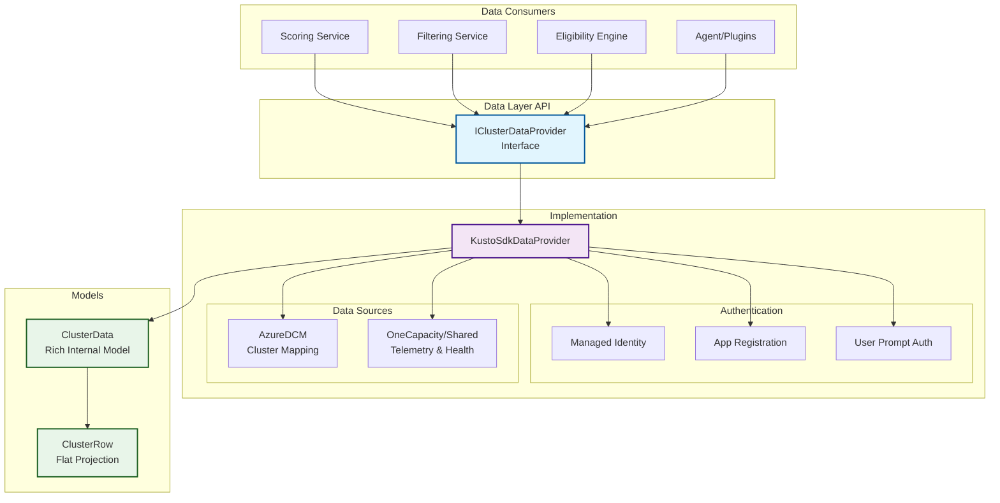
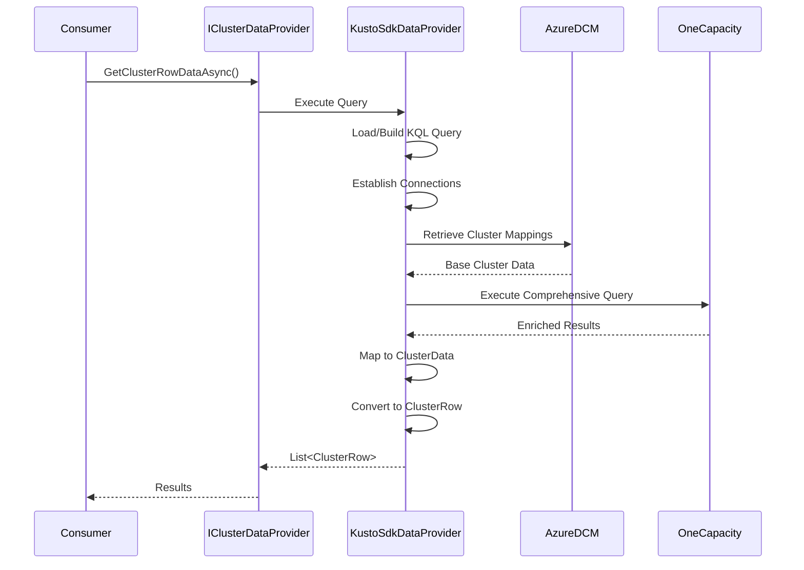

# Data Layer Documentation

## Executive Summary

The data layer serves as the foundational abstraction for cluster telemetry access in the Decommissioning Agent system. It provides a unified interface for data retrieval, implements robust Kusto-based data access patterns, and delivers consistent domain models throughout the application stack. This layer handles complex cross-cluster queries, authentication scenarios, and data transformations while maintaining null-safety and operational resilience.

## Architecture Overview



## Core Components

### 1. IClusterDataProvider Interface

The `IClusterDataProvider` interface defines the contract for all data access operations. It provides a clean abstraction layer that enables:

- **Testability**: Easy mocking for unit tests
- **Flexibility**: Multiple implementation strategies
- **Consistency**: Unified data access patterns

#### Interface Methods

```csharp
public interface IClusterDataProvider
{
    // Rich model operations
    Task<List<ClusterData>> GetClusterDataAsync();
    Task<ClusterData?> GetClusterDetailsAsync(string clusterId, CancellationToken ct = default);
    
    // Flat projection operations
    Task<List<ClusterRow>> GetClusterRowDataAsync(CancellationToken ct = default);
    Task<ClusterRow?> GetClusterRowDetailsAsync(string clusterId, CancellationToken ct = default);
    
    // Health and diagnostics
    Task<bool> TestConnectionAsync(CancellationToken ct = default);
    Task<string> GetDataSourceInfoAsync(CancellationToken ct = default);
}
```

### 2. KustoSdkDataProvider Implementation

The `KustoSdkDataProvider` is the production implementation that orchestrates complex data retrieval operations across multiple Kusto clusters.

#### Key Features

**Multi-Cluster Architecture**
- **AzureDCM**: Primary source for cluster mappings and core metadata
- **OneCapacity/Shared**: Telemetry, utilization metrics, and health data
- Cross-cluster queries executed with appropriate context switching

**Authentication Flexibility**
- **Managed Identity**: Preferred for production deployments
- **App Registration**: Service principal authentication for automation scenarios
- **User Prompt**: Interactive authentication for development/debugging

**Query Management**
- Dynamic query loading from filesystem with embedded fallback
- Comprehensive KQL composition with multiple data source joins
- Optimized query execution with connection pooling

#### Data Composition Pipeline

The provider executes a sophisticated multi-stage query that combines:

1. **Base Cluster Set**
   - Gen4 cluster identification from AzureDCM
   - Core cluster properties and metadata

2. **Utilization Metrics**
   - Core allocation and usage patterns
   - VM density and distribution
   - Computed ratios: `CoreUtilization`, `VMDensity`, `EffectiveCoreUtilization`

3. **Infrastructure Health**
   - Node health statistics
   - Out-of-service percentages
   - Stranding indicators

4. **Regional Context**
   - Hot region identification and prioritization
   - Regional health scores and projections
   - Normalized region keys for consistent joining

5. **Workload Signals**
   - Platform service presence (SLB, WARP)
   - Tenant workload characteristics
   - Stickiness indicators

#### Resilience Patterns

**Retry Logic**
```csharp
// Configurable retry with exponential backoff
private async Task<T> ExecuteWithRetryAsync<T>(Func<Task<T>> operation)
{
    for (int attempt = 0; attempt < MaxRetries; attempt++)
    {
        try
        {
            return await operation();
        }
        catch (Exception ex) when (attempt < MaxRetries - 1)
        {
            await Task.Delay(TimeSpan.FromSeconds(Math.Pow(2, attempt)));
        }
    }
}
```

**Connection Health Monitoring**
- Lightweight connectivity tests using minimal queries
- Composite health status across all data sources
- Detailed diagnostics via `GetDataSourceInfoAsync()`

### 3. Domain Models

#### ClusterData (Rich Model)

The `ClusterData` class represents the complete cluster information as retrieved from Kusto queries. It includes:

- **Identity**: Cluster ID, name, and unique identifiers
- **Location**: Region, datacenter, availability zone
- **Lifecycle**: Age, creation date, decommission windows
- **Infrastructure**: Hardware generation, SKU, node counts
- **Metrics**: Detailed utilization and health statistics

#### ClusterRow (Flat Projection)

The `ClusterRow` class provides a simplified, flat view optimized for:

- **Filtering Operations**: All properties are nullable to support partial matching
- **Scoring Algorithms**: Normalized numeric values for consistent calculations
- **Serialization**: Efficient JSON/XML representation for API responses

Key design principles:
- **Null Safety**: Every property is nullable to accurately represent missing data
- **Type Consistency**: Standardized types for filtering and comparison
- **Derived Values**: Pre-computed ratios and percentages for performance

## Data Flow Architecture

### Query Execution Flow



### Data Transformation Pipeline

1. **Raw Query Results** → `IDataReader` with column mapping
2. **Type-Safe Extraction** → Null-preserving getters (`GetSafeString`, `GetSafeInt`, etc.)
3. **Rich Model Creation** → `ClusterData` with all available fields
4. **Flat Projection** → `ClusterRow` with normalized values

## Integration Patterns

### Dependency Injection Setup

```csharp
// Program.cs configuration
builder.Services.AddSingleton<IClusterDataProvider>(serviceProvider =>
{
    var logger = serviceProvider.GetRequiredService<ILogger<KustoSdkDataProvider>>();
    var configuration = serviceProvider.GetRequiredService<IConfiguration>();
    
    return new KustoSdkDataProvider(
        logger,
        dcmClusterUri: configuration["Kusto:ClusterUri"],
        dcmDatabase: configuration["Kusto:DatabaseName"],
        onecapClusterUri: configuration["OneCapacityKusto:ClusterUri"],
        onecapDatabase: configuration["OneCapacityKusto:DatabaseName"],
        useManagedIdentity: !bool.Parse(configuration["Kusto:UseUserPromptAuth"] ?? "false"),
        defaultTimeout: TimeSpan.FromSeconds(int.Parse(configuration["Kusto:TimeoutSeconds"] ?? "300"))
    );
});
```

### Consumer Integration Examples

**Scoring Service**
```csharp
public class ScoringService
{
    private readonly IClusterDataProvider _dataProvider;
    
    public async Task<List<ScoreResult>> ScoreAllAsync()
    {
        var clusters = await _dataProvider.GetClusterRowDataAsync();
        return clusters.Select(c => CalculateScore(c)).ToList();
    }
}
```

**Filtering Plugin**
```csharp
public class ClusterFilteringPlugin
{
    public async Task<FilterResult> ExecuteFiltersAsync(FilterCriteria criteria)
    {
        var allClusters = await _dataProvider.GetClusterRowDataAsync();
        return ApplyFilters(allClusters, criteria);
    }
}
```

## Operational Considerations

### Performance Optimization

- **Query Caching**: Results are not cached by default; consider implementing caching for frequently accessed data
- **Connection Pooling**: Kusto client handles connection pooling automatically
- **Batch Operations**: Current implementation loads all data; consider pagination for large datasets

### Monitoring and Diagnostics

**Health Check Endpoints**
- `/health/data`: Tests connectivity to all data sources
- `/health/data/info`: Returns detailed connection status

**Logging Strategy**
- Query execution times and row counts
- Authentication method selection
- Connection failures and retry attempts
- Query file loading status

### Security Best Practices

1. **Credential Management**
   - Use Managed Identity in production
   - Store app registration secrets in Key Vault
   - Rotate credentials regularly

2. **Query Security**
   - Parameterized queries to prevent injection
   - Read-only permissions on Kusto clusters
   - Audit logging for data access

## Troubleshooting Guide

### Common Issues and Solutions

| Issue | Symptoms | Resolution |
|-------|----------|------------|
| Query File Not Found | Falls back to embedded query | Verify file path in deployment; check `src/Queries/GEN4QUERY.klq` |
| Authentication Failures | Connection test fails | Check auth configuration; verify Managed Identity or app registration |
| Timeout Errors | Queries exceed timeout | Increase `TimeoutSeconds` in configuration; optimize KQL |
| Null Data Fields | Missing values in results | Expected behavior; handle nulls in consuming code |
| Cross-Cluster Join Failures | Incomplete results | Verify network connectivity between clusters |

### Diagnostic Commands

```bash
# Test connectivity
curl https://localhost:5001/health/data

# Get detailed status
curl https://localhost:5001/health/data/info

# Check application logs
docker logs decom-agent --tail 100 | grep "KustoSdkDataProvider"
```

## Extension Guide

### Adding New Data Fields

1. **Update KQL Query**
   ```kql
   | extend NewField = compute_new_field()
   ```

2. **Extend ClusterData Model**
   ```csharp
   public class ClusterData
   {
       public string? NewField { get; set; }
   }
   ```

3. **Update Mapping Logic**
   ```csharp
   NewField = reader.GetSafeString(columnMap, "NewField")
   ```

4. **Add to ClusterRow Projection**
   ```csharp
   public class ClusterRow
   {
       public string? NewField { get; set; }
   }
   ```

5. **Update Conversion Logic**
   ```csharp
   NewField = clusterData.NewField
   ```

### Implementing Custom Providers

To create alternative data providers:

1. Implement `IClusterDataProvider` interface
2. Register in dependency injection
3. Maintain null-safety conventions
4. Implement health check methods

## Appendix: Field Reference

### ClusterRow Properties

| Category | Fields | Description |
|----------|--------|-------------|
| **Identity** | `ClusterId`, `ClusterName` | Unique identifiers |
| **Location** | `Region`, `DataCenter`, `AvailabilityZone` | Geographic placement |
| **Lifecycle** | `ClusterAge`, `EarliestDecomWindow`, `LatestDecomWindow` | Temporal attributes |
| **Intent** | `FabricIntent`, `CustomerIntent` | Deployment purpose |
| **Infrastructure** | `HardwareGeneration`, `HardwareSku`, `NodeCount` | Physical resources |
| **Utilization** | `AllocatedCoreCount`, `CoreUtilization`, `VMDensity` | Resource usage |
| **Health** | `HealthyNodeCount`, `OutOfServicePercentage`, `StrandedNodeCount` | Operational status |
| **Regional** | `IsHotRegion`, `RegionHealthScore`, `RegionHealthLevel` | Regional context |

### Derived Metrics

- **CoreUtilization**: `AllocatedCoreCount / (NodeCapacityCores * NodeCount)`
- **VMDensity**: `VMCount / AllocatedCoreCount`
- **HealthyNodeRatio**: `HealthyNodeCount / NodeCount`
- **EffectiveCoreUtilization**: Combined utilization considering all factors

---

*This documentation is maintained by the Azure Decommissioning Agent team. For questions or contributions, please refer to the project's contribution guidelines.*