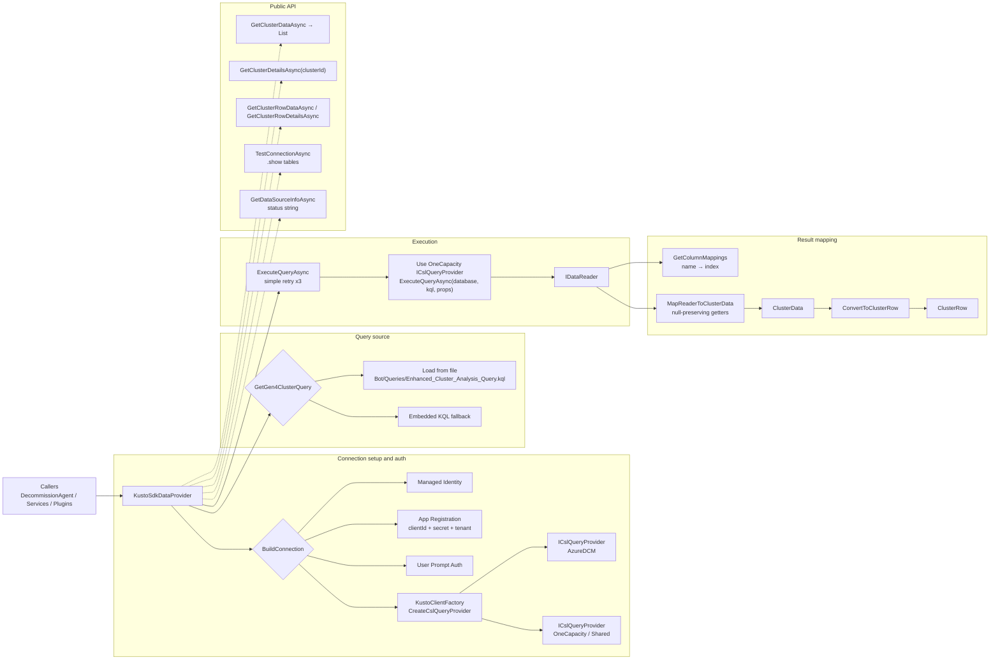

# KustoSdkDataProvider Documentation

## Architecture Overview

We use **KustoSdkDataProvider.cs** as the one concrete data access layer for Kusto. It manages two clients: one to **azuredcm.kusto.windows.net** (AzureDCMDb) and one to **onecapacityfollower.centralus.kusto.windows.net** (Shared). It runs the end to end Gen4 cross cluster KQL, streams rows via `IDataReader`, and maps them into the strongly typed models the rest of our code expects (`ClusterData` and the flattened `ClusterRow`). It is registered behind `IClusterDataProvider` in DI, and the DecommissionAgent, services, and SK plugins call into it.

Connection setup follows our flowchart’s **Conn** lane. A centralized `BuildConnection` picks the best auth automatically: Managed Identity first, then App Registration (client ID, secret, tenant), and finally interactive user auth for local dev. With that builder, `KustoClientFactory.CreateCslQueryProvider` gives us two `ICslQueryProvider`s, one for AzureDCM and one for OneCapacity or Shared.

For the **KQL** lane, `GetGen4ClusterQuery` tries to load a checked in KQL file (for example `Bot/Queries/Enhanced_Cluster_Analysis_Query.kql` or a `.kql` in the repo). If it is not there, it falls back to an embedded, validated KQL string. The query scopes to Gen4 compute clusters, aggregates utilization and capacity from `EfficiencyTracker_Get_LatestDecommInsights`, joins cluster properties and age snapshots, derives tenant and workload signals, pulls the latest global hot region cache, adds regional health predictions, and projects a single normalized record per cluster.

Execution is the **Exec** lane. `ExecuteQueryAsync` wraps the SDK call with a simple three try retry with short backoffs and rethrow on the last failure. The big analysis runs through the OneCapacity or Shared provider because that is where the cross cluster caches live. Results are streamed with `IDataReader` so we never load the entire result set into memory.

Mapping is the **Map** lane. We precompute a column name→ordinal dictionary to avoid repeated `GetOrdinal` lookups, then read each row with null preserving, type safe getters into a `ClusterData`. When needed, we flatten to `ClusterRow` for UI, filtering, and scoring. This keeps Kusto nulls intact and avoids lossy conversions.

The public surface, the **API** lane, gives us practical calls: `GetClusterDataAsync` and `GetClusterDetailsAsync` return `ClusterData`; `GetClusterRowDataAsync` and `GetClusterRowDetailsAsync` return `ClusterRow`. `TestConnectionAsync` does a quick “`.show tables | take 1`” ping against both databases, and `GetDataSourceInfoAsync` returns a concise status string with endpoints, connectivity health, and a timestamp for fast diagnostics.

Elsewhere, `Program.cs` wires the provider into DI, registers downstream services like `ScoringService` that depend on `IClusterDataProvider`, and can run a startup smoke test so we get early signals if credentials, endpoints, or query files are off. The DecommissionAgent and its SK plugins then pull from this provider to drive eligibility checks, filtering, scoring, and adaptive card rendering.

This works because it cleanly separates concerns so all Kusto auth, execution, and mapping live behind one interface, is resilient with multiple auth modes, retries, and a query fallback, is performant with streamed reads and precomputed ordinals, and is consumer friendly with typed, null safe models. For a quick sanity check, we run `TestConnectionAsync` and `GetDataSourceInfoAsync`, then call `GetClusterDataAsync` and verify we get a sensible row count and the fields our UI and scoring paths expect.
