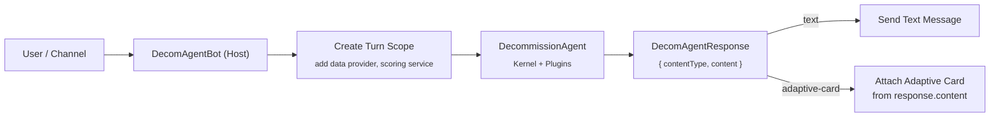
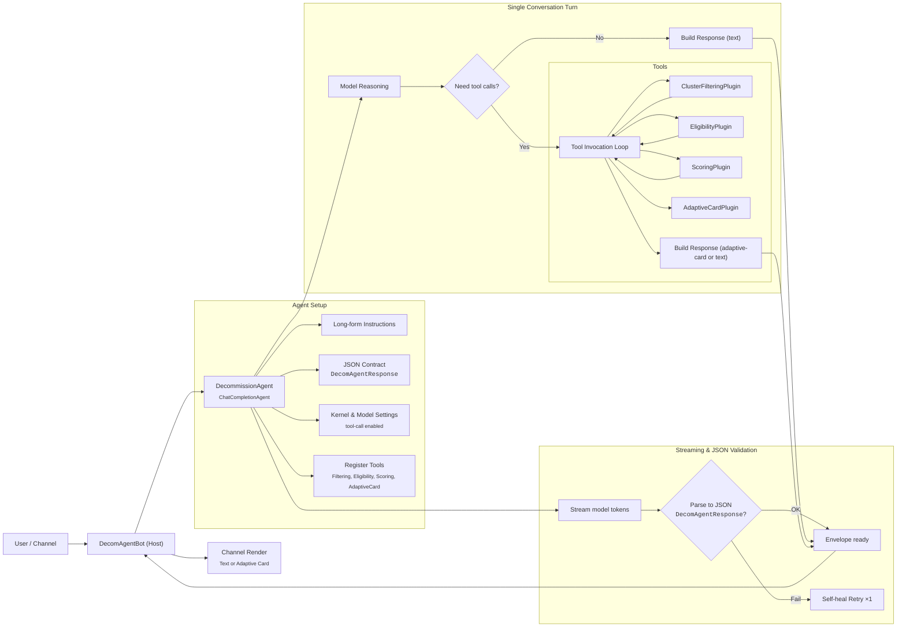

# DecomAgent Documentation

## Architecture Overview

The **DecommissionAgent** is a thin Semantic Kernel wrapper that turns our domain tools into an LLM-driven reasoning core, configured as a `ChatCompletionAgent` with strict instructions and a forced JSON output contract. At startup we set the agent name and long-form instructions describing what it can do—filter clusters, run eligibility checks, compute scores, and present top-N candidates. We bind it to the shared `Kernel` with OpenAI execution settings that allow the model to auto-call tools and require a JSON object response.

We dynamically add four plugins from DI—`ClusterFiltering`, `Scoring`, `Eligibility`, and `AdaptiveCard`—so the model can invoke them as functions during a conversation. The output schema is a two-field envelope with `contentType` set to `Text` or `AdaptiveCard` and `content` as the body string. This matches the dedicated DTO used elsewhere, and the instructions say to return nothing but that envelope.

When invoked, the agent streams model messages into a buffer, then parses the JSON once the stream completes. If parsing fails, we perform a single self-healing retry with a corrective prompt and then return a strongly typed envelope that the bot can render.

Behaviorally, the prompt teaches the agent to parse multi-constraint user asks, including top-N, age and utilization thresholds, region and DC filters, workload flags, health criteria, and weight tweaks. It picks the right tool for each subtask—`EligibilityPlugin` for rules, `ClusterFilteringPlugin` for criteria, `ScoringPlugin` for ranking, and `AdaptiveCardPlugin` for visualization—and then responds only with the JSON envelope. The filtering, scoring, and eligibility capabilities are spelled out in the prompt, including supported criteria types, weight semantics, and examples for prioritizing age, utilization, or health.

In production, the Agents Builder host **DecomAgentBot** wires channel messages to this agent, preserves chat history, streams “working” updates, and returns the agent envelope—so user text becomes tool-augmented reasoning and either plain text or a ready-to-render Adaptive Card. The bot instantiates the agent per turn and calls `InvokeAsync` with the user input and shared history. DI registration in `Program.cs` covers the agent dependencies (the `Kernel`, data provider, and scoring service), and we can optionally construct the agent through DI if we prefer.

---

## DecomAgentResponse (Output Contract)

**Purpose.** This is the canonical response schema shared between the agent and the bot. It guarantees that every model turn yields one of two renderable payloads: plain text or an Adaptive Card JSON.

**File.** `DecomAgentResponse.cs`
**Types.**

* `enum DecomAgentResponseContentType`

  * `"text"`
  * `"adaptive-card"` (stringified Adaptive Card JSON)
* `sealed class DecomAgentResponse`

  * `contentType : DecomAgentResponseContentType`
  * `content : string` (either plain text, or the **string** containing an Adaptive Card payload)

**Serialization.**

* Uses `System.Text.Json` with `JsonSerializerDefaults.Web`.
* `JsonStringEnumConverter` ensures enum values serialize as `"text"` / `"adaptive-card"`.
* Compact output (`WriteIndented = false`) for channel efficiency.

**Agent usage.**

* The agent builds exactly one `DecomAgentResponse` per turn.
* On JSON parse failure, the agent performs a single **self-heal retry**, reminding the model to output only the envelope.

**Rendering contract (Bot).**

* If `contentType == text`: send `content` directly as a chat message.
* If `contentType == adaptive-card`: treat `content` as **Adaptive Card JSON**; attach it to the outgoing activity using the channel’s Adaptive Card attachment mechanism. On card errors, fall back to a safe text message.

**Examples.**

*Text envelope*

```json
{
  "contentType": "text",
  "content": "Top 5 candidates: CLUS-0123, CLUS-0456, CLUS-0789, CLUS-1122, CLUS-1455."
}
```

*Adaptive Card envelope (string contains card JSON)*

```json
{
  "contentType": "adaptive-card",
  "content": "{ \"type\": \"AdaptiveCard\", \"$schema\": \"http://adaptivecards.io/schemas/adaptive-card.json\", \"version\": \"1.5\", \"body\": [ { \"type\": \"TextBlock\", \"size\": \"Large\", \"weight\": \"Bolder\", \"text\": \"Top Decommission Candidates\" } ] }"
}
```

> Note: For cards, the `content` field remains a **string**. Downstream code is responsible for parsing it into the channel’s attachment type.

---

## DecomAgentBot (Host & Orchestration)

**Purpose.** Serves as the **channel host** using Microsoft Agents Builder, handling turn lifecycle, DI scopes, message routing, and rendering `DecomAgentResponse` objects.

**File.** `DecomBot.cs`
**Type.** `class DecomAgentBot : AgentApplication`

### Responsibilities

1. **Turn wiring & history.** Receives channel activities, maintains conversation context, and delegates user text to the agent.
2. **Scoped DI composition.** For each turn, creates a scope and constructs a turn-specific service collection that includes:

   * `IClusterDataProvider` (Kusto access via `KustoSdkDataProvider`)
   * `ScoringService`
   * Any per-turn settings the plugins require
3. **Agent lifecycle (per turn).** Instantiates/configures the `DecommissionAgent` with the shared `Kernel` and registers the four plugins so tool calls are available.
4. **Help & onboarding.** Responds to `"help"` (and first-run) with a short **HelpMessage** that lists capabilities and example prompts.
5. **Response rendering.** Calls `agent.InvokeAsync(...)`, receives a `DecomAgentResponse`, and:

   * sends **text** directly, or
   * attaches the **Adaptive Card** to the outgoing message; on failure, falls back to a simplified text.

### Message Flow (high level)



### Error Handling & Resilience

* **Welcome/Help fallback.** If sending a rich welcome fails (channel capability issues), the bot logs and falls back to a minimal text prompt.
* **Card failures.** If the Adaptive Card payload can’t be attached, the bot sends a simplified text message noting the issue and (optionally) includes a link or snippet.

### Configuration & DI

* `Program.cs` registers:

  * the **Kernel** and model settings,
  * `IClusterDataProvider` (Kusto),
  * `ScoringService`,
  * agent/plugins factory hooks.
* The bot composes these into a **per-turn** service collection so each invocation is clean and isolated.

### Quick Test Path

* Type **`help`** → bot returns the HelpMessage and examples.
* Ask **“top 10 decommission candidates”** → bot creates agent, agent filters/scores via tools, bot renders **text** or an **Adaptive Card** list.
* Try **filters** (e.g., “gen4 only, age > 5y, exclude hot regions”) → agent routes to `ClusterFilteringPlugin` + `ScoringPlugin`, bot renders results.

---

## Appendix: DecomAgent – Single-Turn Orchestration (Mermaid)



