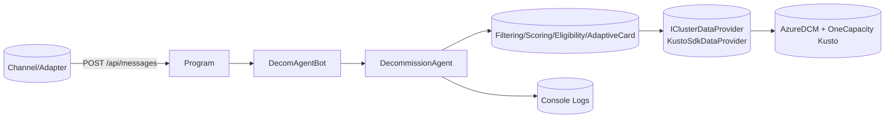
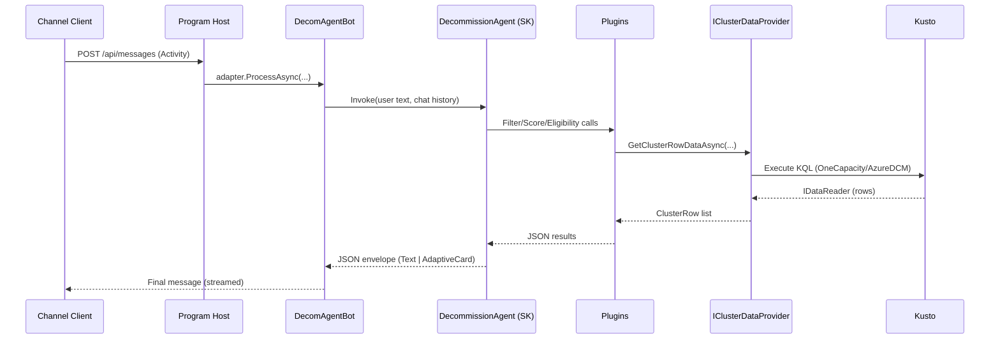

Awesome—I'll include `Program.cs` as a first‑class “service” in the docs suite. Kicking off now.

---

# /docs/services/Program.md

Program

1. Role in the System
   • Bootstraps and hosts the Decommission Agent bot process.
   • Wires up Semantic Kernel (Azure OpenAI), Kusto data access, domain services (scoring/eligibility), and the Microsoft Agents Builder host.
   • Exposes the `/api/messages` endpoint for channel adapters; provides dev health routes and startup connectivity checks.
   • Consumers (Upstream): Channel adapters (Teams/Web/DirectLine via Agents Builder). Local dev/browser for root health.
   • Dependencies (Downstream): Azure OpenAI (chat completions), Kusto (AzureDCM + OneCapacity), in‑process bot/agent components.
   • Resiliency: Startup connectivity check logs success/failure and continues with degraded functionality if Kusto is unavailable (dev mode). Safe error logging during initialization; memory storage for transient state in dev.

2. Class & Module Inventory
   • Public Entry Points

* `Program` top‑level statements (ASP.NET Core host).
* HTTP endpoint: `POST /api/messages` routes to `IAgentHttpAdapter.ProcessAsync(...)`.
  • Core “Classes” composed here (registered via DI)
* `DecomAgentBot` (Agents Builder bot) — registered with `builder.AddAgent<DecomAgentBot>()`.
* `IClusterDataProvider` → `KustoSdkDataProvider` singleton (builds connections to both Kusto clusters).
* `ScoringService` singleton (explainable scoring over `ClusterRow`).
* Semantic Kernel: `AddKernel()` + Azure OpenAI chat completion (deployment/endpoint/key from config).
* Storage: `IStorage` → `MemoryStorage` (dev).
  • Supporting Components
* `AgentApplicationOptions`, `IAgent`, `IAgentHttpAdapter` from Agents Builder.
* Configuration sections: `Kusto`, `OneCapacityKusto`, `Azure` (OpenAI).
  • Config & Feature Flags
* `Kusto: UseUserPromptAuth` (true → user prompt auth; false → MSI).
* `Kusto: TimeoutSeconds` (query timeout).
* `Azure: OpenAIDeploymentName`, `OpenAIEndpoint`, `OpenAIApiKey`.
  • When it’s used & by whom
* Process startup (app host) initializes everything.
* Channel requests call into the bot endpoint → agent → plugins/services.

3. Invocation Points (Where & When It’s Called)
   • Sync calls

* HTTP `POST /api/messages` per incoming activity; invokes `IAgentHttpAdapter.ProcessAsync`.
  • Async triggers
* None scheduled here; agent’s internal streaming is async per turn.
  • Operational lifecycle
* Cold start: builds DI container, configures SK + Kusto, registers bot.
* Steady‑state: serves chat turns, streams responses, maintains in‑memory state.
* Shutdown: standard ASP.NET Core host disposal.

4. Collaboration with Other Services
   • Contracts & Schemas

* Request: Bot Framework/Agents Builder Activity schema via adapter.
* Response: Text and Adaptive Card attachments (agent decides).
  • Transaction Boundaries
* Each HTTP activity is independent; agent/thread state scoped via turn state & memory storage (dev).
* Kusto calls are read‑only queries with simple retry in provider; no cross‑service transaction semantics.
  • Performance Constraints
* OpenAI and Kusto latencies dominate. Timeout configured via Kusto provider; streaming used to keep user informed.
* Backpressure handled by ASP.NET request queue and Channels; no custom backpressure here.

5. Internal Architecture & Data Flow
   • Critical path

1) ASP.NET receives activity → adapter → `DecomAgentBot`.
2) Bot builds scoped services per turn (injects `IClusterDataProvider`, `ScoringService`, Kernel).
3) Bot invokes `DecommissionAgent` (SK agent) → Plugins (Filtering/Scoring/Eligibility/AdaptiveCards).
4) If plugin needs data → `IClusterDataProvider` (Kusto).
5) Agent returns JSON envelope → Bot renders text or Adaptive Card to the channel.
   • State

* Volatile conversation state via `MemoryStorage` (dev). No persistent DB.
  • Error handling
* Try/catch around boot and per‑turn execution; friendly messages on failures.
* Kusto connectivity check on startup logs success or warns but does not crash in dev.
  • Observability
* Console logging enabled; startup logs Kusto connectivity and query test counts.
* Structured log messages for success/failure paths.

6. Mermaid Diagrams





```mermaid
flowchart TB
  In[Activity JSON] --> Proc[Program: build DI, route to Bot]
  Proc --> Bot[DecomAgentBot turn handler]
  Bot --> Agent[DecommissionAgent (SK)]
  Agent --> Calls[Plugins: Filtering/Scoring/Eligibility/Card]
  Calls --> Data[(Kusto data via IClusterDataProvider)]
  Agent --> Out[Adaptive Card or Text]
```

7. Operations & Runbook Tips
   • Common failures

* Kusto auth fails in dev: check `Kusto: UseUserPromptAuth` vs MSI; verify tenant/device login.
* OpenAI config missing: verify deployment, endpoint, key; SK will throw during `AddAzureOpenAIChatCompletion`.
* Adaptive Card parse error: fall back text is sent; inspect agent JSON envelope and card shape.
  • Dashboards/alerts
* Local/dev: console logs only. In prod, wire to App Insights and Kusto query logs.
  • Safe deploy/rollback
* App is stateless; rolling restart safe. Keep OpenAI/Kusto config backward compatible.
* If moving away from `MemoryStorage`, ensure storage provider migration steps.
  • Schema migration gotchas
* None in host; downstream Kusto schemas can evolve—provider maps nullable, but renames/removals require code updates.

8. FAQs & Extension Points
   • Add a new plugin/tool → Register via `KernelPluginFactory.CreateFromType<T>()` inside `DecommissionAgent` or add a DI service and inject.
   • Add a new endpoint/job → Extend ASP.NET endpoints in `Program` or add controller; for scheduled work, add a hosted service.
   • Where to plug business rules → `ClusterEligibilityEngine` and `ScoringService` (weights/catalog) without changing bot shell.
   • Testing strategy

* Host: minimal integration test hitting `/api/messages` with a fake adapter.
* Services: unit test `ScoringService`, `ClusterEligibilityEngine`, `ClusterFilterEngine`.
* Data: mock `IClusterDataProvider` to avoid Kusto in tests.
  • Local dev
* Use `UseDeveloperExceptionPage`; hit root `/` for health string; watch console for Kusto connectivity and returned row counts.

---

If you want me to continue, I’ll proceed alphabetically through the rest of the services next (AdaptiveCardPlugin → … → ScoringService) and produce each `/docs/services/{ServiceName}.md`, then finish with `/docs/architecture.md`.
