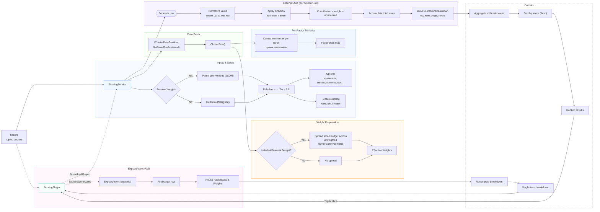

# Scoring Documentation

The Cluster Decommissioning Agent's scoring system provides a sophisticated, configurable, and explainable approach to identifying and prioritizing clusters for decommissioning. This document details the architecture, features, and usage patterns of the scoring system.

## Overview

The scoring system evaluates Azure clusters against multiple factors including age, utilization, health, regional context, and workload constraints. It uses a weighted model that:

- Normalizes diverse metrics to comparable scales
- Supports customizable weighting profiles
- Provides detailed factor-by-factor explanations
- Handles missing data gracefully
- Adjusts for factors where "lower is better"
- Employs optional statistical techniques like winsorization

## Architecture Overview

The scoring layer consists of a  **ScoringService** (the explainable, math-y core) and **ScoringPlugin** (the SK-facing wrapper). ScoringService implements a weight-based model over `ClusterRow` fields with clear explainability: it supports raw and derived factors, coerces percent-like inputs to 0..1, applies optional winsorization before min–max normalization, inverts factors where “lower is better,” and treats missing values neutrally (0.5)【turn5file5L15-L21】【turn5file10L18-L29】. It exposes a feature catalog for discovery (name, kind, unit, higher-is-better)【turn5file2L34-L47】, a default weight profile centered on age, utilization, health, stranding, region context, and stickiness (with normalization via `Rebalance`)【turn5file11L25-L35】【turn5file11L60-L70】, and a direction map that flips contributions for “bad-when-high” signals like hot regions or sticky workloads【turn5file11L5-L13】【turn5file11L19-L23】. At runtime, `ScoreAllAsync` pulls all rows from the data provider, optionally spreads a small “IncludeAllNumericBudget” across unweighted numeric/derived fields, computes per-factor min/max (winsorized if configured), then builds ranked `ScoreRowBreakdown` records with per-factor raw value, normalized value, weight, and contribution; `ExplainAsync` returns the same breakdown for a single cluster【turn5file0L31-L43】【turn5file0L50-L58】【turn5file1L50-L58】. The **ScoringPlugin** is what the agent calls: its prompt advertises `ScoreTopNAsync` and `ExplainScoreAsync`, letting the model pass custom weights and (optionally) pre-filter criteria; results come back as top-N with factor highlights so they’re easy to render in text or Adaptive Cards【turn5file12L21-L35】. Concretely, the plugin deserializes an optional weights JSON, invokes `ScoreAllAsync`, takes the top N, and serializes a compact object containing cluster id, score, and the top contributing factors—falling back to defaults if weights aren’t supplied【turn5file8L3-L11】【turn5file8L18-L25】【turn5file8L26-L49】. Everything is wired up via DI: the app registers a singleton `ScoringService`, and the agent adds the ScoringPlugin as a tool so the LLM can call it directly during a conversation【turn5file7L24-L25】【turn5file14L57-L61】.
