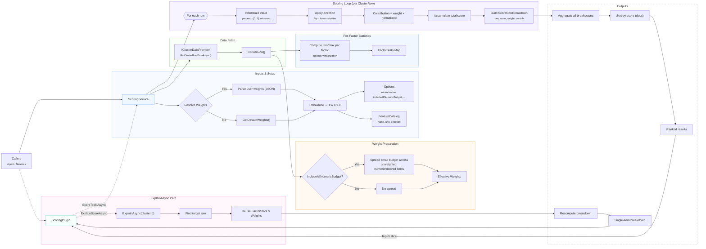

# Scoring Documentation

The Cluster Decommissioning Agent's scoring system provides a sophisticated, configurable, and explainable approach to identifying and prioritizing clusters for decommissioning. This document details the architecture, features, and usage patterns of the scoring system.

## Overview

The scoring system evaluates Azure clusters against multiple factors including age, utilization, health, regional context, and workload constraints. It uses a weighted model that:

- Normalizes diverse metrics to comparable scales
- Supports customizable weighting profiles
- Provides detailed factor-by-factor explanations
- Handles missing data gracefully
- Adjusts for factors where "lower is better"
- Employs optional statistical techniques like winsorization

## Architecture Overview



## Core Components

The scoring system is architected as a two-tier solution designed for both programmatic access and AI-driven interactions:

### ScoringService: The Analytical Engine

At the heart of the system lies the **ScoringService**, a sophisticated analytical engine that implements an explainable, mathematically rigorous scoring model. This service orchestrates multiple advanced capabilities:

**Intelligent Data Processing**
- **Multi-Factor Analysis**: Evaluates clusters across diverse dimensions including operational metrics, business constraints, and regional contexts
- **Adaptive Normalization**: Employs statistical techniques to ensure fair comparison across heterogeneous metrics:
  - Automatically detects and converts percentage-based inputs to a standardized 0-1 range
  - Applies configurable winsorization to handle outliers without distorting the overall distribution
  - Implements min-max normalization post-winsorization for consistent scaling
- **Directional Intelligence**: Maintains a sophisticated understanding of metric semantics, automatically inverting scores for "lower-is-better" factors (e.g., high utilization or sticky workloads indicate poor decommissioning candidates)
- **Graceful Degradation**: Handles missing or incomplete data elegantly by assigning neutral scores (0.5), ensuring partial data doesn't unfairly penalize or favor clusters

**Feature Discovery and Management**
- **Self-Documenting Feature Catalog**: Exposes a comprehensive catalog that enables dynamic feature discovery, including:
  - Feature metadata (name, data type, unit of measurement)
  - Directional indicators (whether higher values are favorable)
  - Statistical properties and valid ranges
- **Flexible Weight Profiles**: Ships with an expertly-tuned default weight configuration that balances:
  - Temporal factors (cluster age and lifecycle stage)
  - Utilization metrics (resource consumption patterns)
  - Health indicators (operational stability)
  - Business constraints (stranding risk, regional dependencies)
  - Workload characteristics (stickiness, migration complexity)
- **Dynamic Rebalancing**: Automatically normalizes weight distributions to ensure mathematical consistency (Σw = 1.0)

**Advanced Scoring Pipeline**
The service executes a sophisticated multi-stage pipeline:
1. **Data Acquisition**: Retrieves comprehensive cluster data via the injected `IClusterDataProvider`
2. **Weight Distribution**: Optionally distributes a configurable "exploration budget" across unweighted factors, ensuring no potentially valuable signal is completely ignored
3. **Statistical Analysis**: Computes factor-specific statistics (min, max, distribution) with optional outlier handling
4. **Score Computation**: For each cluster:
   - Normalizes raw values using computed statistics
   - Applies directional adjustments based on factor semantics
   - Calculates weighted contributions
   - Aggregates into a final interpretable score
5. **Explainability Generation**: Produces detailed breakdowns showing:
   - Raw factor values
   - Normalized scores
   - Applied weights
   - Individual contributions to the final score

### ScoringPlugin: The AI Integration Layer

The **ScoringPlugin** serves as an intelligent bridge between the analytical engine and AI agents, implementing the Semantic Kernel plugin pattern:

**Natural Language Interface**
- **Intuitive Method Exposure**: Presents scoring capabilities through AI-friendly methods:
  - `ScoreTopNAsync`: Returns the highest-scoring clusters with customizable result count
  - `ExplainScoreAsync`: Provides detailed scoring breakdown for individual clusters
- **Flexible Parameter Handling**: Accepts both structured parameters and natural language descriptions, with intelligent parsing and validation

**Adaptive Result Formatting**
- **Context-Aware Serialization**: Dynamically adjusts output format based on the consumption context:
  - Compact summaries for conversational responses
  - Detailed breakdowns for analytical deep-dives
  - Adaptive Card-ready structures for rich UI rendering
- **Top Factor Highlighting**: Automatically identifies and emphasizes the most significant contributing factors, making results immediately actionable

**Robust Error Handling**
- **Graceful Fallbacks**: Seamlessly reverts to default configurations when custom parameters are invalid or incomplete
- **Informative Error Messages**: Provides clear, actionable feedback for configuration issues
- **Defensive Programming**: Validates all inputs and handles edge cases to ensure consistent operation

### Dependency Injection and Integration

The entire scoring system is elegantly integrated into the application through modern dependency injection patterns:

```csharp
// Core service registration
builder.Services.AddSingleton<ScoringService>();
builder.Services.AddTransient<ScoringPlugin>();

// Agent integration
kernel.Plugins.AddFromType<ScoringPlugin>();
```

This architecture ensures:
- **Testability**: All components can be easily mocked and tested in isolation
- **Extensibility**: New scoring factors or algorithms can be added without disrupting existing functionality
- **Performance**: Singleton service pattern ensures efficient resource utilization
- **Flexibility**: Plugin-based architecture allows for easy integration with different AI models and frameworks

The scoring system represents a perfect balance between mathematical rigor and practical usability, providing operations teams with powerful, explainable insights while remaining accessible through natural language interactions.